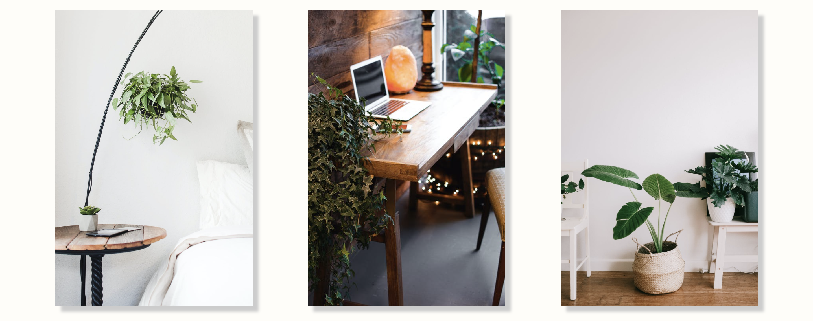

### Live production site available [here](https://ct-urban-shopping.netlify.app/)!

 

### The Stack

- Programming Language - JavaScript
- Frontend - React & Styled Components
- Framework - Gatsby
- Backend - GraphQL
- Authentication - Firebase
- Data Management - Contentful
- Shopping Cart - Snipcart
- Contact Form - Formspree.io
- Styling - Bootstrap & CSS & Material UI
- Hosting - Netlify

 

### This was built to mimic an actual online plant website with features that include, plants for purchase, authentication, inspiration ideas, plant care tips, about the company, FAQ page, as well as a contact form.

 

### Welcome to the Homepage, which contains a little bit about Urban Roots, Our Services, Customer Reviews and some Inspiration images.

 

### This is the Shop page which displays available plants that are available for purchase, which can completed by using the Snipcart shopping cart! Each product is displayed with a picture, title, price and when you hover over the image it will display the plants' description.

 

### This is the Sign Up page, where a user can create an account!

 

### This is the Login page, where a user can login to their account!

 

### This is the Password Reset page, if a user forgets their password all they need to do is provide their email and will receive an email with instructions on how to reset their password.

 

### When a user is logged in the Navbar display a logout button instead of the Login and Sign Up buttons.

 

### The FAQ page is where frequently asked questions are answered, each question can be clicked on that shows a drop down of the answer provided.

 

 

### This is the Shipping & Delivery page that goes into detail about the shipping fees.

 

 

### On the Contact Us page the user will be able to fill out the contact form, that can be used for questions, special requests or feedback that will be sent to the Urban Roots team.

 

 

### On the About Us page, we go into detail about Urban Roots' mission on providing great quality plants & much more!

 

 

### This is the Plant Care Tips page where you can find helpful tips on how to properly take care of your new plant(s)!

 

 

### This is the Inspiration page where you can find new ways to decorate with your new plant(s) that have been added to your collection!

 

